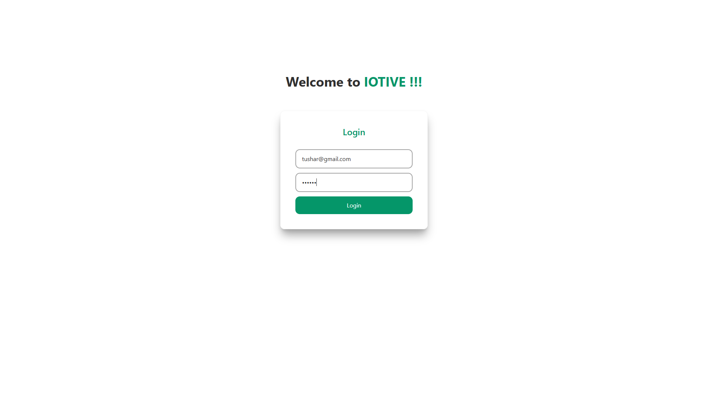
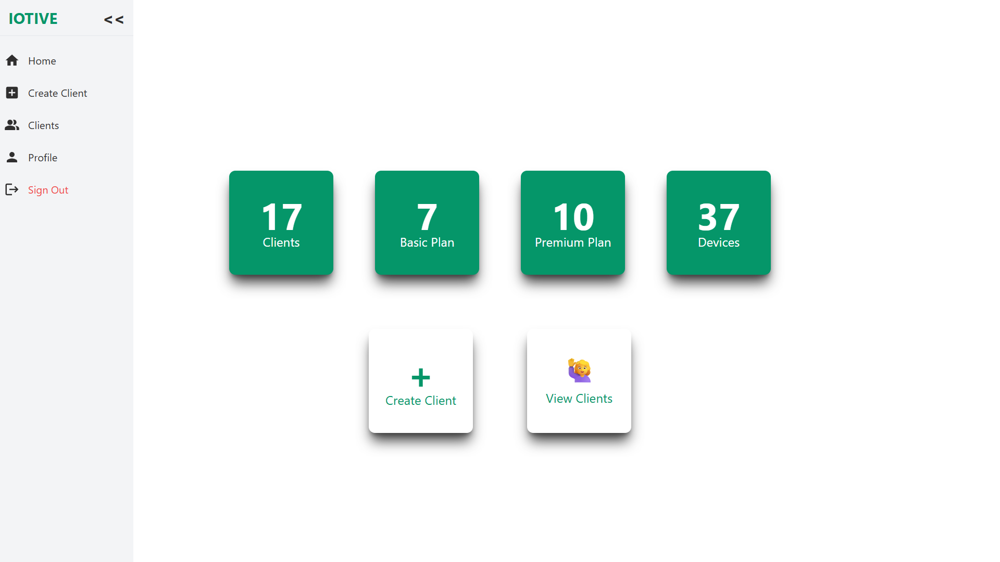
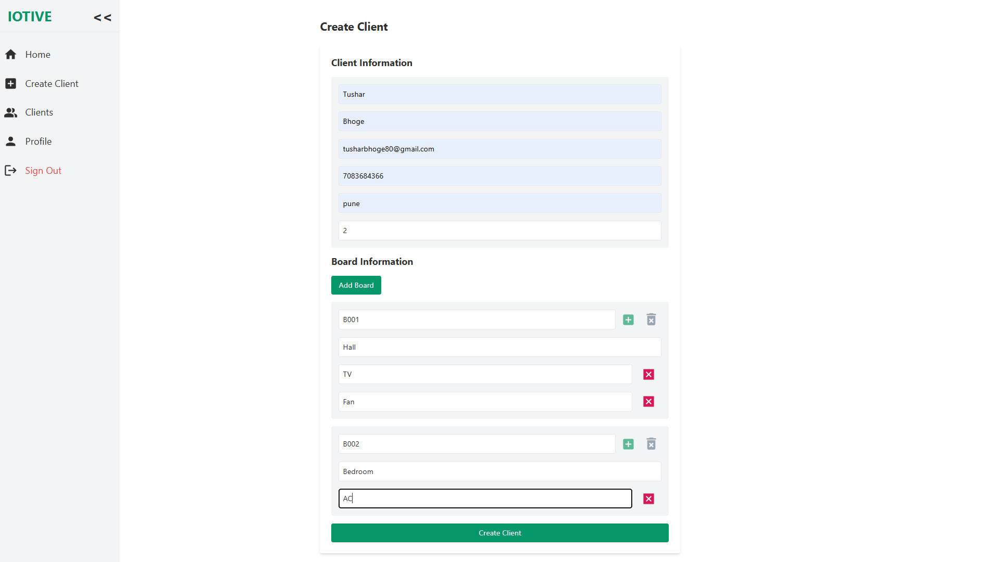
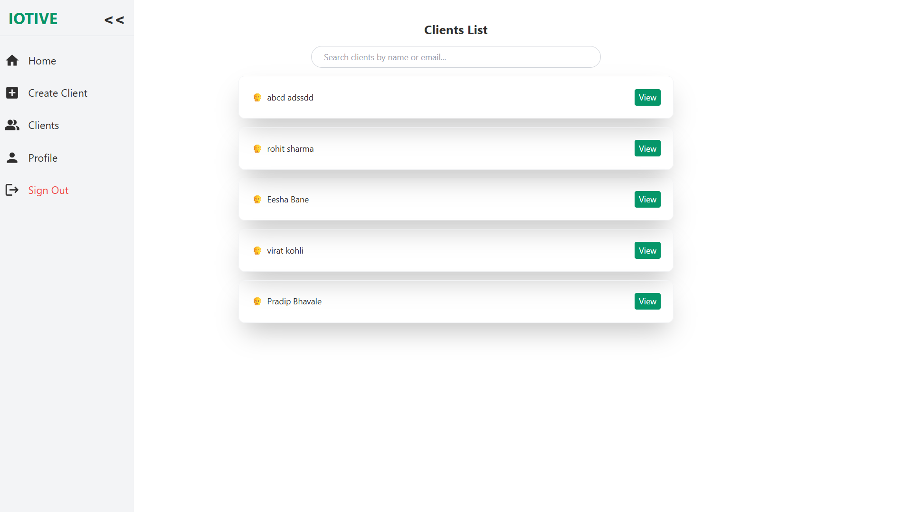
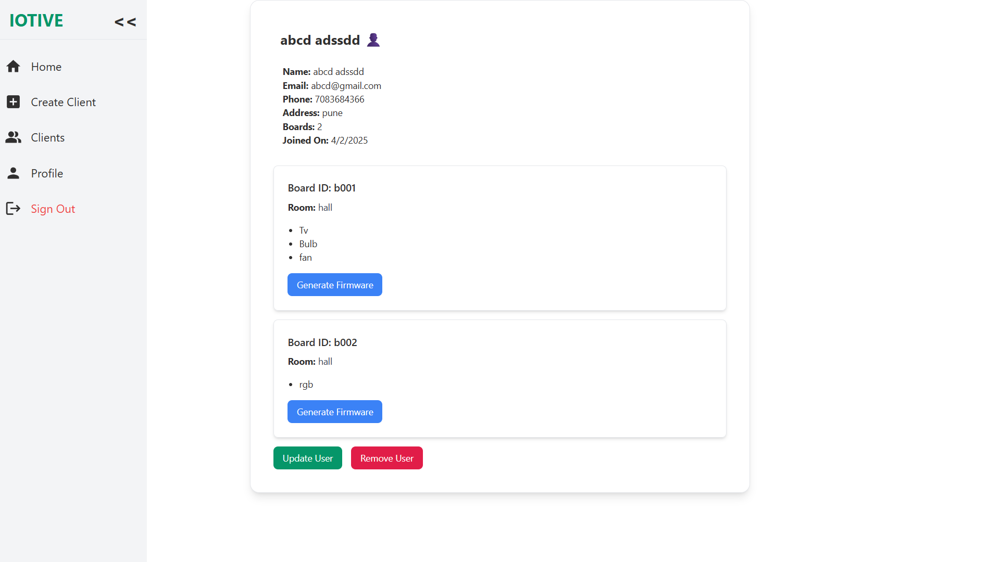
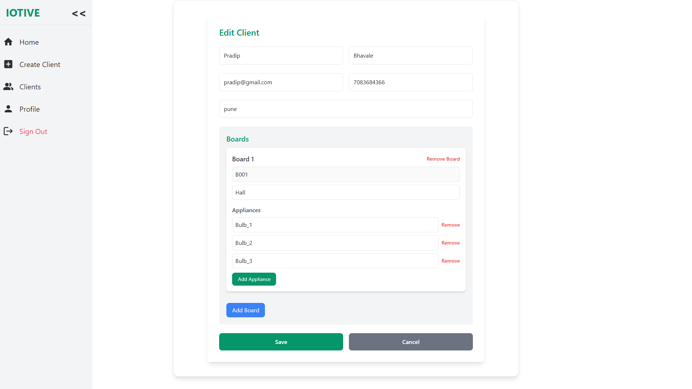

# 🔌 IOTive – Smart Home Automation Manager

IOTive is a full-stack solution designed to streamline the workflow for **home automation company**. It manages clients, board configurations, and dynamic firmware generation for ESP-based IoT devices, allowing seamless integration and monitoring.

---

## 🧠 Overview

**Purpose:**  
To help home automation company efficiently manage clients, devices, and board setups, and to generate dynamic, per-client firmware for ESP devices based on their appliance configuration.

---

## 🛠️ Features

- 🔐 Client registration and authentication via Firebase Auth
- 🗃️ CRUD operations for client profiles
- 🧩 Manage board configurations:
  - Number of boards per client
  - Appliance types (e.g., fan, light, AC)
  - Room-specific configurations
- ⚙️ Dynamic firmware generation per client.
- 🧪 Automated firmware compilation using `Arduino CLI` and flashing using `esptool.py`
- 📊 Dashboard for admins to track all configurations

---

## 🧪 Tech Stack

- **Frontend:** React.js  
- **Backend:** Node.js, Express.js  
- **Database:** Firebase Firestore  
- **Authentication:** Firebase Authentication  
- **Realtime:** Firebase Realtime Database  
- **Firmware:** Arduino CLI, esptool.py  

---
## ⚙️ Firmware Feature Usage Note

To use the firmware generation and flashing feature, make sure you have both **Arduino CLI** and **esptool.py** installed on your system.

### 🔧 Required Commands:

- **To Compile Firmware:**

```bash
arduino-cli compile --fqbn esp32:esp32:lilygo_t_display --library "${arduinoLibraryPath}" --output-dir "${firmwareDir}" "${firmwarePath}"
``` 
- **To Flash Firmware:**
```bash
esptool.py --chip esp32 --port ${port} --baud 115200 write_flash -z 0x1000 ${formattedPath}
```

---
## 📦 How It Works

### 🔧 Client & Board Management
- Admin can add/update/delete client records.
- Each client can have multiple boards with different appliances.
- Room-level mapping of appliances.

### 🛠️ Dynamic Firmware Generation
- Based on the board setup, a `.ino` file is generated dynamically.
- Compiled using `arduino-cli`.
- Flashed to the ESP microcontroller using `esptool.py`.
---
## File structure :
**1. Frontend :**
```
client/
├── node_modules/
├── public/
├── src/
│   ├── assets/
│   ├── components/
│   │   ├── adminComponents/
│   │   │   ├── AddBoard.jsx
│   │   │   ├── AdminHome.jsx
│   │   │   ├── AdminProfile.jsx
│   │   │   ├── ClientInfo.jsx
│   │   │   ├── CreateClient.jsx
│   │   │   ├── EditClientForm.jsx
│   │   │   └── ViewClient.jsx
│   │   ├── Auth/
│   │   │   ├── CreateAdmin.jsx
│   │   │   ├── Login.jsx
│   │   │   └── RequireAuth.jsx
│   │   ├── context/
│   │   │   ├── AdminContext.jsx
│   │   │   └── AuthProvider.jsx
│   │   ├── Dashboard/
│   │   │   ├── AdminDashboard.jsx
│   │   │   └── UserDashboard.jsx
│   │   ├── db/
│   │   │   └── firebase.js
│   │   ├── images/
│   │   │   ├── iotivelogo.jpeg
│   │   │   └── AAAa.jsx
│   │   ├── other/
│   │   │   ├── AdminNavbar.jsx
│   │   │   └── Navbar.jsx
│   │   └── pages/
│   │       ├── ControlPanelComponents.jsx
│   │       └── UserHome.jsx
│   └── UserComponents/
├── App.css
├── App.jsx
├── index.css
├── index.html
├── main.jsx
├── .gitignore
├── eslint.config.js
├── package.json
├── package-lock.json
├── postcss.config.js
├── tailwind.config.js
└── vite.config.js

```
**2. Backend :**
```
server/
├── firestoreinfo/
│   └── path-to-your-service-account.json
├── node_modules/
├── src/
│   ├── controllers/
│   │   ├── adminController.js
│   │   ├── createClientController.js
│   │   ├── deleteClientController.js
│   │   ├── firmwareController.js
│   │   ├── readClientController.js
│   │   └── updateClientController.js
│   ├── db/
│   │   ├── firebaseAdmin.js
│   │   └── index.js
│   ├── firmwares/
│   │   ├── firmwares.bin
│   │   ├── firmwares.ino
│   │   ├── firmwares.ino.bootloader.bin
│   │   ├── firmwares.ino.elf
│   │   ├── firmwares.ino.map
│   │   ├── firmwares.ino.merged.bin
│   │   └── firmwares.ino.partitions.bin
│   ├── middlewares/
│   │   └── authMiddleware.js
│   ├── models/
│   ├── routes/
│   │   ├── adminRoutes.js
│   │   └── firmwareRoutes.js
│   ├── services/
│   │   ├── compileFirmware.js
│   │   ├── flashFirmware.js
│   │   └── generateFirmwareCode.js
│   └── utils/
│       ├── setCustomClaims.js
├── app.js
├── constants.js
├── index.js
├── .env
├── .gitignore
├── .prettierrc
├── package.json
├── package-lock.json
└── README.md

```
---
## 🧑‍💻 How to Run Locally

```bash
# Clone the repo
git clone https://github.com/tusharbhoge/IOTive.git
cd IOTive

# Install frontend dependencies
cd client
npm install
npm run dev

# Install backend dependencies
cd ../server
npm install
npm run dev
```
---
## 🖼️ Snapshots

### 🔹 Login page UI


### 🔹 Dashboard UI


### 🔹 Client creation UI


### 🔹 Clients page UI


### 🔹 Client Info page UI


### 🔹 Update client page UI

